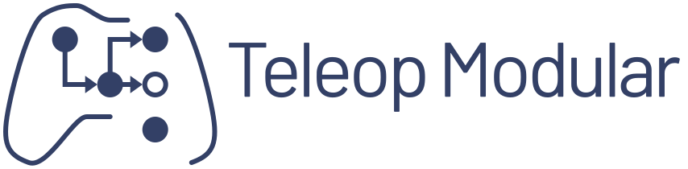
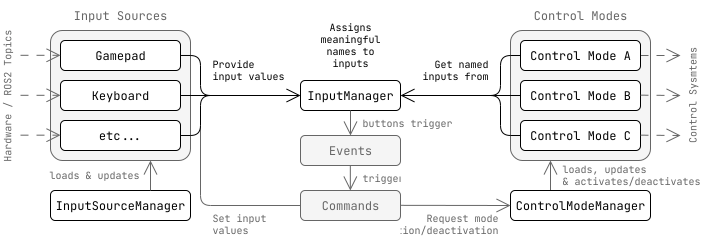

<a href="https://baileychessum.github.io/teleop_modular/">
  <div align="center">
    <picture>
      <source media="(prefers-color-scheme: light)" srcset="docs/images/logo_text.svg">
      <source media="(prefers-color-scheme: dark)" srcset="docs/images/logo_white_text.svg">
      
    </picture>
  </div>
</a>

<br/>

[](https://opensource.org/licenses/Apache-2.0)
[](https://github.com/BaileyChessum/teleop_modular/actions/workflows/ci.yml?query=branch%3Amain)

# teleop_modular

Teleop Modular is a general framework for multimodal teleoperation in ROS2.

Please refer to the [documentation](https://baileychessum.github.io/teleop_modular/) for information on how to use the teleop_modular packages.

## Overview

<a href="https://baileychessum.github.io/teleop_modular/">
  <div align="center">
    <picture>
      <source media="(prefers-color-scheme: light)" srcset="docs/images/diagrams/architecture_diagram_light.svg">
      <source media="(prefers-color-scheme: dark)" srcset="docs/images/diagrams/architecture_diagram_dark.svg">
      
    </picture>
  </div>
</a>

There are two main plugin types used in the framework:

- **Input Sources** provide input values
- **Control Modes** use *meaningfully* named inputs to create high level control messages to send to some control system.

Every input source and control mode get their own node from which to retrieve parameters, spawned by the teleop_node 
(architecture for which is simplified in the above diagram).

> What does *meaningfully* named mean? Most teleop packages map inputs from specific sources directly to control messages:
>
> ```cpp
> twist.linear.x = joy_msg[3];    //< Not meaningful, and tightly coupled to joy
> ```
>
> Instead, teleop_modular allows control modes to ask for with a name that describes what the input is actually used
> for:
>
> ```cpp
> linear_.x = inputs.axes["linear.x"];  //< get input shared_ptr with meaningful name
> // ...
> twist.linear.x = *linear_.x;
> ```
> 
> We no longer need to care where we get our inputs from.

### Motivation

`teleop_modular` aims to:
- Make it easier to extend your teleop packages.
- Prevent tight coupling to a specific input source.
- Centralize management of multiple control modes.
  - Integration with `ros2_control` to dynamically switch active controllers for each control mode.
- Allow new control modes to be easily added using plugins.
  - Promote experimentation with control modes.
  - Allow control mode code to be reused to achieve different functionality 
    (e.g. configuring control modes to use different reference frames).
- Allow novel input sources to be developed and integrated with existing systems
- Improve configuration for individual input sources

## Plugins

This is a list of plugins you can use with teleop_modular. Please post plugins to the [discussions](https://github.com/BaileyChessum/teleop_modular/discussions/categories/general) page to add them to this list.

#### Control Modes

- [teleop_modular_twist/TwistControlMode](./teleop_modular_twist) -- A control mode that sends [Twist](https://docs.ros2.org/latest/api/geometry_msgs/msg/Twist.html) and [TwistStamped](https://docs.ros2.org/latest/api/geometry_msgs/msg/TwistStamped.html) messages.

Use [control_mode_template](https://github.com/BaileyChessum/control_mode_template) to generate empty control mode packages, and implement custom control modes for your robot.

#### Input Sources

- [teleop_modular_joy/JoyInputSource](./teleop_modular_joy) -- An input source for joystick devices, accepting [Joy](https://docs.ros2.org/latest/api/sensor_msgs/msg/Joy.html) messages.

## Contributing

All are welcome to contribute. As `teleop_modular` is still very experimental, I'm keen to hear feedback on any aspect of using the package with your robots.

Please post in the [discussions](https://github.com/BaileyChessum/teleop_modular/discussions/categories/general) page -- we are happy to help in any way we can!

#### PRs

Feel free to make a fork of the repository, and raise a pull request with any changes you wish to contribute. Any changes you submit will be under the [Apache 2.0 License](./LICENSE.txt).

#### Issues

You are welcome to [raise new issues](https://github.com/BaileyChessum/teleop_modular/issues/new) for any bugs or feature requests.

The project development roadmap is outlined for each upcoming version as [Milestones](https://github.com/BaileyChessum/teleop_modular/milestones).


