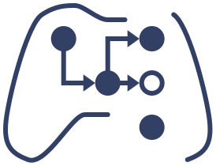

<picture align="left">
  <source media="(prefers-color-scheme: light)" srcset="assets/logo.svg">
  <source media="(prefers-color-scheme: dark)" srcset="assets/logo_white.svg">
  
</picture>

# Teleop Modular Documentation

Welcome to the documentation for the `teleop_modular` packages! 

### Guides

To get started using Teleop Modular, please follow these guides:

- [Getting started](./getting_started.md)
- [Writing a teleop package](./writing_a_teleop_package.md)
- [Remapping and transforming inputs](./remapping_and_transforming_inputs.md)
- Writing a `ControlMode` plugin
- Using multiple control modes
- Adding a lock

These guides cover various ways to provide inputs: 

- Complex input using state Commands
- Writing an `InputSource` plugin
- Providing inputs without an input source using services

These guides discuss advanced topics:

- Running multiple teleop_nodes

### About

These docs describe various technical aspects of Teleop Modular: 

- [Input source remapping](./input_source_remapping.md)